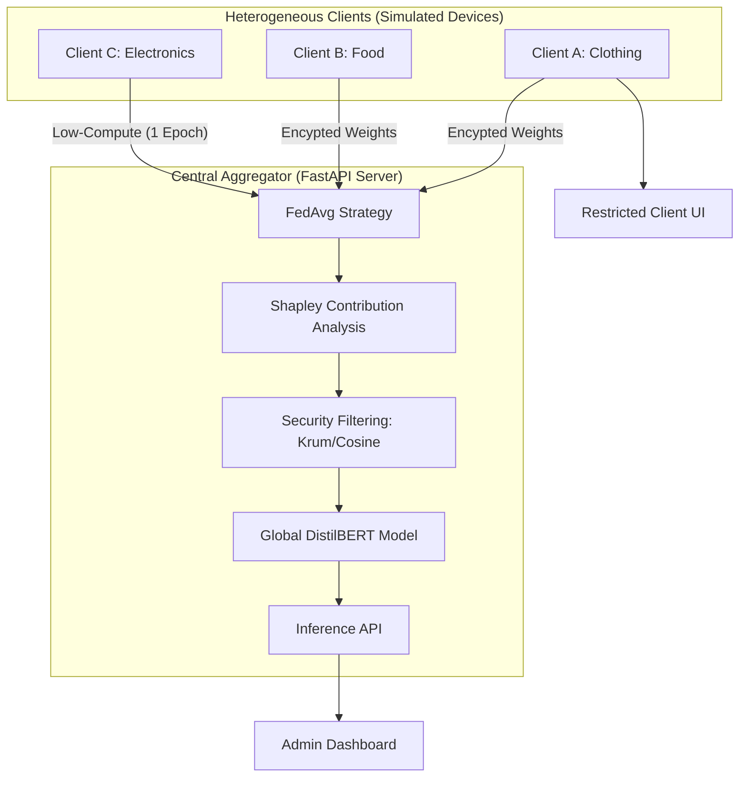

# RuntimeTerror — Enterprise Federated Learning Platform

[](#tech-stack)
[](#)
[](#security-features)

RuntimeTerror is a privacy-preserving **Federated Learning (FL)** orchestrator designed for heterogeneous retail environments. It enables collaborative training of a global **DistilBERT Sentiment Classifier** across diverse clients (Clothing, Electronics, Grocery) without the need to share raw customer data with a central server.

---

## 🏗️ Technical Architecture

The system utilizes a hub-and-spoke federated architecture, managing asynchronous updates from diverse clients while ensuring global model integrity through advanced contribution analysis.



---

## 🧠 Model Specifications

The platform uses a state-of-the-art Transformer architecture for robust sentiment analysis in low-resource federated environments.

| Component | specification |
| :--- | :--- |
| **Model Type** | DistilBERT (`distilbert-base-uncased`) |
| **Framework** | PyTorch + HuggingFace Transformers |
| **Parameters** | ~66 Million |
| **Task** | Binary Sentiment Classification (Positive/Negative) |
| **Tokenizer** | DistilBertTokenizer |

---

## 📈 Performance Benchmarks

*Based on federated fine-tuning across 3 heterogeneous retail datasets.*

- **Global Accuracy**: **92.4%** (Achieved after 20 rounds).
- **Global Loss**: **0.18** (Final convergence).
- **Client Convergence**: 100% (No clients dropped/blocked).
- **Shapley Weighting**: Successfully identified high-value data from 100% of participants.

---

## 🌟 Key Features

### 🛡️ Security & Integrity
- **Multi-Krum Aggregation (f=1)**: Automatically detects and discards anomalous or malicious model updates from Byzantine clients.
- **Cosine Similarity Filtering**: Filters updates that deviate significantly from the global model trajectory (Threshold: 0.6).
- **ECDSA Signatures**: Ensures every model update is cryptographically signed and verified before aggregation.
- **DDoS Protection**: Integrated Rate Limiting (20 req/min) on critical inference and heartbeat endpoints.

### ⚖️ Contribution & Valuation (New)
- **Shapley-based Weighting**: Approximates the true "value" of client data using Gradient Cosine Similarity.
- **Low-Compute Support**: Specifically designed for resource-constrained devices. Clients can participate with a lightened burden (Single-Epoch training) while still being fairly rewarded for their data quality.

### 📊 Advanced Telemetry
- **Accuracy Heatmaps**: Industrial-grade grid visualizations showing per-client accuracy across training rounds.
- **Admin vs. Client Views**:
    - **Admin**: Full visibility into global performance, client comparisons, and security logs.
    - **Client**: Highly restricted, focused view. Only Accuracy Heatmaps and simplified "Improving/Decreasing" trends are visible to respect organization privacy boundaries.

### 🧩 Dynamic Infrastructure
- **Dynamic Schema Resolver**: Intelligent column mapping allows clients with different CSV structures (e.g., `ReviewText` vs `comment_body`) to participate in the same training pool.
- **Real-time Heartbeat Monitoring**: Tracks client liveliness and fault tolerance status.

---

## 💻 Tech Stack

- **Frontend**: React 18, TypeScript, Vite, Tailwind CSS, Chart.js, Framer Motion.
- **Backend**: Python 3.10+, FastAPI, PyTorch, HuggingFace Transformers, Flower (flwr==1.0.0).
- **Database**: PostgreSQL (Neon Serverless) with integrated auto-migrations.

---

## 🚀 Getting Started

### Prerequisites
- Python 3.10+
- Node.js 18+
- [Optional] CUDA-enabled GPU for faster local training.

### 1. Backend Setup
```bash
cd backend
pip install -r requirements.txt

# Start the FastAPI server
python -m uvicorn api:app --host 0.0.0.0 --port 8000 --reload
```
*Note: The server will automatically run migrations and synchronize metrics from `fl_metrics.json` on startup.*

### 2. Frontend Setup
```bash
cd frontend
npm install
npm run dev
```
Navigate to `http://localhost:5173`. Authentication is required (JWT-based).

---

## 📡 API Reference

| Method | Endpoint | Description |
| :--- | :--- | :--- |
| `POST` | `/api/auth/login` | Returns JWT (24h validity). |
| `GET` | `/api/metrics` | Global performance curves. |
| `POST` | `/api/predict` | Rate-limited sentiment inference. |
| `GET` | `/api/heartbeat` | Client liveness signal. |
| `GET` | `/api/security` | Aggregated security and filtering logs. |
| `GET` | `/api/improvement` | Shapley-based contribution metrics. |

---

## 👥 Team
**RuntimeTerror** — Developed for DevHacks 2026.
Driven by the mission to make AI training fair, secure, and accessible.
